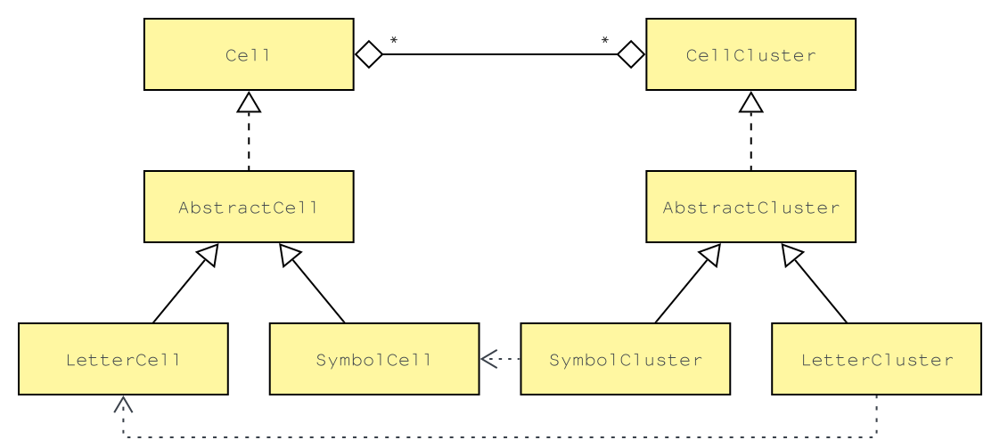

# Terminal-Takedown

## Description
A replication of the Fallout 3 / 4 hacking minigame using JavaFX.

The hacking puzzles in Fallout 3 and 4 involve accessing terminals by cracking passwords through a word game. Players are presented with a list of words and must choose the correct password based on similarity to a selected word. Each guess provides feedback on how many letters are correctly placed. Techniques to assist in solving the puzzle include eliminating dud words through bracket sequences and strategically choosing words based on the feedback received from previous guesses. Incorrect attempts can lock players out, but exiting the minigame before the last attempt resets the puzzle.

This game closely resembles the classic board game Mastermind. In Mastermind, one player sets a hidden code and the other player guesses the sequence, receiving feedback on the accuracy of each guess. Similarly, in Fallout’s hacking puzzle, players choose words and receive feedback on how many letters match the correct password's position, guiding them to the correct choice. Both games require logical deduction and pattern recognition to deduce the correct answer based on feedback from incorrect attempts.

## Javadoc:

[API Documentation](https://mr-slinky.github.io/HackMaster/docs/com.slinky.hackmaster/module-summary.html)

## Understanding the Code – Backend Architecture

### Cells and Clusters

To grasp the foundational aspects of the code, it's essential to begin with the core interfaces: `Cell` and `CellCluster`. These interfaces, especially `Cell`, serve as the fundamental building blocks of the program's interactive components.

The `Cell` interface is implemented by the `AbstractCell` class, which offers a default implementation for behaviours common to all `Cell` types. Two concrete classes, `LetterCell` and `SymbolCell`, extend `AbstractCell` by adding specific behaviours to manage letters and symbols, respectively.

Similarly, the `CellCluster` interface is implemented by the `AbstractCluster` class. `AbstractCluster` provides default behaviours for all `CellClusters`, such as retrieving the first and last `Cell` objects. The concrete implementations, `LetterCluster` and `SymbolCluster`, specialise in containing `LetterCell` and `SymbolCell` objects, respectively.

### Cell Management and Clustering

The `CellController` interface defines the contract for classes responsible for managing and clustering `Cell` objects. Currently, the only concrete implementation of this interface is the `CellMaster` class.

The `CellMaster` class is constructed with a `SymbolClusterStrategy`, provided through dependency injection. This strategy defines the rules for clustering symbols into `SymbolCluster` objects. A similar strategy is not required for letters due to the straightforward nature of clustering letters.