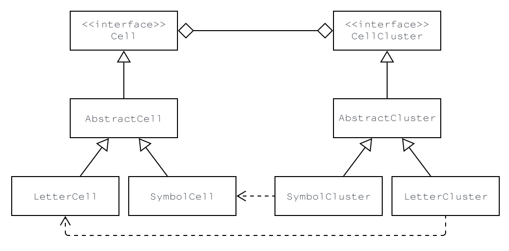

# Hack Master

## Description
A replication of the Fallout 3 / 4 hacking minigame using JavaFX.

The hacking puzzles in Fallout 3 and 4 involve accessing terminals by cracking passwords through a word game. Players are presented with a list of words and must choose the correct password based on similarity to a selected word. Each guess provides feedback on how many letters are correctly placed. Techniques to assist in solving the puzzle include eliminating dud words through bracket sequences and strategically choosing words based on the feedback received from previous guesses. Incorrect attempts can lock players out, but exiting the minigame before the last attempt resets the puzzle.

This game closely resembles the classic board game Mastermind. In Mastermind, one player sets a hidden code and the other player guesses the sequence, receiving feedback on the accuracy of each guess. Similarly, in Fallout’s hacking puzzle, players choose words and receive feedback on how many letters match the correct password's position, guiding them to the correct choice. Both games require logical deduction and pattern recognition to deduce the correct answer based on feedback from incorrect attempts.

## Javadoc:

[API Documentation](https://mr-slinky.github.io/HackMaster/docs/com.slinky.hackmaster/module-summary.html)

## Understanding the Code – Backend Architecture

### Model

#### Cells and Clusters

To grasp the foundational aspects of the code, it's essential to begin with the core interfaces: `Cell` and `CellCluster`. These interfaces, especially `Cell`, serve as the fundamental building blocks of the program's interactive components.

The `Cell` interface is implemented by the `AbstractCell` class, which offers a default implementation for behaviours common to all `Cell` types. A key feature of the `AbstractCell` class is the use of observable properties for the content (character) and state. These observable properties allow listeners to be attached to them in the controller and view classes, enabling responsive updates within the UI. Two concrete classes, `LetterCell` and `SymbolCell`, extend `AbstractCell` by adding specific behaviours to manage letters and symbols, respectively.

Similarly, the `CellCluster` interface is implemented by the `AbstractCluster` class. `AbstractCluster` provides default behaviours for all `CellClusters`, such as retrieving the first and last `Cell` objects. The concrete implementations, `LetterCluster` and `SymbolCluster`, specialise in containing `LetterCell` and `SymbolCell` objects, respectively.

#### Cell Management and Clustering

Cell instantiation and management are handled by implementations of the `CellManager` interface, which assumes implementing classes will work with cells as both a 1D and 2D grid. Currently, there is only a single implementation of this interface: `CellGrid`, which manages a 1D array of `Cell` objects while providing mechanisms to work with the cells as a 2D grid.

The `CellGrid` class is provided with a `ClusterStrategy` through dependency injection when it is instantiated. The `ClusterStrategy` class is a functional interface responsible for creating `CellCluster` objects (e.g., `LetterCluster` and `SymbolCluster`). The `ExhaustiveClusterStrategy` class is the only implementation currently, and it aims to identify every possible cluster that exists, specifically symbol clusters, and group them together appropriately. This implementation might need revision, as a symbol belonging to multiple clusters (such as an opening bracket) can only be viewed in a single cluster at a time.

The `CellGrid` class also maintains a reference to all of its created `LetterClusters` to allow the removal of specific words without the words themselves being clicked. This happens when a user clicks a symbol cluster and a dud (incorrect password choice) is removed.

#### Text Management

Text management is one of the simpler aspects of this project. The `com.slinky.hackmaster.model.text` package contains various classes that facilitate the management and production of text within the context of the game.

The core component of this package is the `WordSet` interface, designed to offer a set of words reminiscent of those found in the original Fallout games. There are currently five predefined `WordSet` objects, each corresponding to one of the `Difficulty` enum instances. These instances are instantiated statically within the `WordBank` class and can be accessed by providing the associated `Difficulty`, which returns the corresponding predefined `WordSet`. 

Beyond simply providing the list of words used in the game, the `WordBank` class also includes algorithms for shuffling the words and for "jumbling" the text. Jumbling refers to the process of interspersing words with a set of symbols to achieve a specific length. This functionality is particularly valuable as it allows any set of words to fit within any sized grid, provided the grid contains more cells than the total number of characters in all the words combined.

The `WordBank` class plays a central role in the global context of the game, especially in the game state, as it maintains references to the correct word and the corresponding incorrect words or "duds." These references are utilized across other parts of the model, as well as within the control and view components of the project.

Currently, the only implementation of the `WordSet` interface is the `StaticWordSet` class, which requires a `JumbleStrategy` implementation upon instantiation. This strategy dictates the behaviour of the `StaticWordSet`'s jumble function.

#### Game State

The game's state is managed primarily by two classes: `GameState` and `GameConstants`.

`GameState` is responsible for maintaining all dynamic fields related to the game, such as the number of live guesses and the current `WordSet` implementation instance. While it handles various aspects like the game palette and wordset, its core responsibility lies in managing the live guesses. The class provides functions to increase, decrease, and reset the number of guesses. The guess field is defined as an observable property, allowing listeners to respond dynamically whenever the number of guesses is updated.

`GameConstants` holds references to key static values, such as the starting guess count, font, and font size. It attempts to load the Courier Prime font (`GameFont.ttf`) from the resources folder and set it as the game’s font. If this attempt is unsuccessful, the class defaults to using a system-provided monospace font.

### View

The `view` package is relatively small, containing only five components, but it includes significant complexity within its internal classes. The game's interface is designed to closely mimic the original game, utilising a nested border pane layout. Components are assigned to the centre and right regions of the main panel, as well as the centre and top regions of the nested panel.

A key component of the `view` package is the `CellView` class, which is responsible for the visual representation of cells and their clusters. The `CellView` class acts as an observer of its `Cell` model, updating itself based on specific user input (which it captures through behaviour inherited from the JavaFX `Label` class) or updates handled by the controller.

The `CenterPanel` class manages a grid of `CellView` objects and is the only UI component that interacts directly with the user. The `TerminalPanel` class is responsible for output and feedback, arranging Labels vertically and clearing them when the viewing area becomes full. The `TopPanel` class (for lack of a better name) displays the program’s heading, as seen in the original game, and includes a “guess bar” that observes the guesses field in `GameState`, updating its visual components to reflect the current number of guesses.

### Controller

The `controller` package contains a single class: `MainController`. This class serves as the controller for the program, though its responsibilities are relatively simple and focused. Many of the views act as observers, automatically updating themselves as needed when the model changes, reducing the need for the controller in those aspects. However, due to the complexity of the events triggered when a cell is clicked, the `MainController`'s primary responsibility lies in coordinating the behaviour of user clicks.

A user click can trigger various events depending on the game’s state and the specific cell clicked. The behaviour of a click is designed to closely mimic the original game. When a user clicks a single cell that does not belong to any larger group or cluster, an error message is displayed along with the symbol, much like in the original game.

When a user clicks on a word, or `LetterCluster`, they might win the game (if the guess is correct), lose the game (if the guess is incorrect and guesses run out), or receive feedback on the correctness of the guess. This process also removes a dud from the `WordSet` within the `GameState`. Once a word is clicked, it dissolves as a cluster and is replaced with periods (`.`).

Users can also click on valid symbol clusters. These clusters can only be clicked once and dissolve upon clicking, though they are not replaced with periods. Clicking a cluster triggers an event with a 20% chance to reset the guesses and an 80% chance to remove a dud from the grid.

